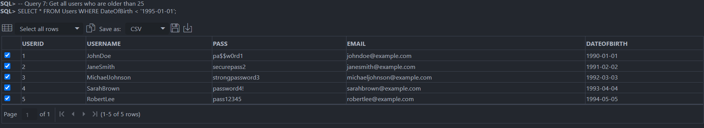
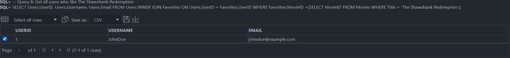
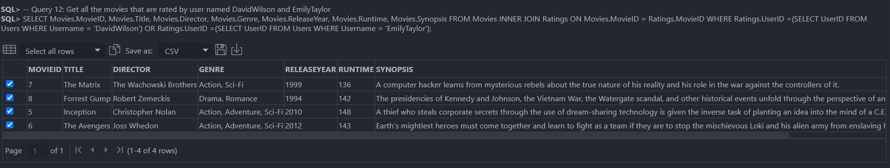
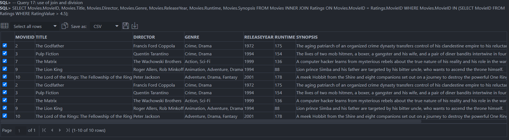

# Database Project

``` 
 Project Name: MovieStreaming Database
 Performed By: Habibur Rahman(1907036)
```
<hr>

## Project Description:
This project is about a movie streaming database. In this database, we have 6 tables. These are:
1. User : This table contains the information about the users. The attributes of this table are:
```
User_ID : Primary Key
Username
Email
Password
DateOfBirth
```
2. Movie : This table contains the information about the movies. The attributes of this table are:
```
Movie_ID : Primary Key
Title
Director
Genre
Release_Year
Runtime
Synopsis
```
3. Rating : This table contains the information about the ratings given by the users. The attributes of this table are:
```
Rating_ID : Primary Key
User_ID : Foreign Key
Movie_ID : Foreign Key
Rating_Value
```
4. Reviews : This table contains the information about the reviews given by the users. The attributes of this table are:
```
Review_ID : Primary Key
User_ID : Foreign Key
Movie_ID : Foreign Key
Review
```
5. Watchlist : This table contains the information about the watchlist of the users. The attributes of this table are:
```
Watchlist_ID : Primary Key
User_ID : Foreign Key
Movie_ID : Foreign Key
```
6. Favorites : This table contains the information about the favorites of the users. The attributes of this table are:
```
Favorites_ID : Primary Key
User_ID : Foreign Key
Movie_ID : Foreign Key
```

##Schema Diagram:


<hr>

## Table Creation
``` 

CREATE TABLE Users (
    UserID number(6) PRIMARY KEY,
    Username VARCHAR(50),
    Pass VARCHAR(50) ,
    Email VARCHAR(100) ,
    DateOfBirth varchar(30)
);

CREATE TABLE Movies (
    MovieID number(6) PRIMARY KEY,
    Title VARCHAR(100) ,
    Director VARCHAR(50),
    Genre VARCHAR(50) ,
    ReleaseYear number(4) ,
    Runtime number(3) ,
    Synopsis varchar(1000)
);

CREATE TABLE Ratings (
    RatingID number(6) PRIMARY KEY,
    UserID number(6),
    MovieID number(6),
    RatingValue DECIMAL(2,1),
    FOREIGN KEY (UserID) REFERENCES Users(UserID),
    FOREIGN KEY (MovieID) REFERENCES Movies(MovieID)
);

CREATE TABLE Reviews (
    ReviewID number(6) PRIMARY KEY,
    UserID number(6),
    MovieID number(6),
    ReviewText varchar(1000),
    FOREIGN KEY (UserID) REFERENCES Users(UserID),
    FOREIGN KEY (MovieID) REFERENCES Movies(MovieID)
);

CREATE TABLE Favorites (
    FavoriteID number(6) PRIMARY KEY,
    UserID number(6) ,
    MovieID number(6),
    FOREIGN KEY (UserID) REFERENCES Users(UserID),
    FOREIGN KEY (MovieID) REFERENCES Movies(MovieID)
);

CREATE TABLE Watchlists (
    WatchlistID number(6) PRIMARY KEY,
    UserID number(6),
    MovieID number(6),
    FOREIGN KEY (UserID) REFERENCES Users(UserID),
    FOREIGN KEY (MovieID) REFERENCES Movies(MovieID)
);

```
<hr>

# DML
- ## Insert
    - ### Inserting into Users Table
    ```
         -- Insert 10 user records into the Users table
     INSERT INTO Users (UserID, Username, Pass, Email, DateOfBirth)
     VALUES (1, 'JohnDoe', 'pa$$w0rd1', 'johndoe@example.com', '1990-01-01');
     INSERT INTO Users (UserID, Username, Pass, Email, DateOfBirth)
     VALUES (2, 'JaneSmith', 'securepass2', 'janesmith@example.com', '1991-02-02');
     INSERT INTO Users (UserID, Username, Pass, Email, DateOfBirth)
     VALUES (3, 'MichaelJohnson', 'strongpassword3', 'michaeljohnson@example.com', '1992-03-03');
     INSERT INTO Users (UserID, Username, Pass, Email, DateOfBirth)
     VALUES (4, 'SarahBrown', 'password4!', 'sarahbrown@example.com', '1993-04-04');
     INSERT INTO Users (UserID, Username, Pass, Email, DateOfBirth)
     VALUES (5, 'RobertLee', 'pass12345', 'robertlee@example.com', '1994-05-05');
     INSERT INTO Users (UserID, Username, Pass, Email, DateOfBirth)
     VALUES (6, 'EmilyTaylor', 'easypassword6', 'emilytaylor@example.com', '1995-06-06');
     INSERT INTO Users (UserID, Username, Pass, Email, DateOfBirth)
     VALUES (7, 'DavidWilson', 'davidpass777', 'davidwilson@example.com', '1996-07-07');
     INSERT INTO Users (UserID, Username, Pass, Email, DateOfBirth)
     VALUES (8, 'OliviaAnderson', 'olivia2023', 'oliviaanderson@example.com', '1997-08-08');
     INSERT INTO Users (UserID, Username, Pass, Email, DateOfBirth)
     VALUES (9, 'DanielClark', 'pass@word9', 'danielclark@example.com', '1998-09-09');
     INSERT INTO Users (UserID, Username, Pass, Email, DateOfBirth)
     VALUES (10, 'SophiaHarris', 'sophia21pass', 'sophiaharris@example.com', '1999-10-10');
    ```
    - ### Inserting into Movies
    ```
    -- Insert 10 movie records into the Movies table
     INSERT INTO Movies (MovieID, Title, Director, Genre, ReleaseYear, Runtime, Synopsis)
     VALUES (1, 'The Shawshank Redemption', 'Frank Darabont', 'Drama', 1994, 142, 'Two imprisoned men bond over several years, finding solace and eventual redemption through acts of common decency.');
     INSERT INTO Movies (MovieID, Title, Director, Genre, ReleaseYear, Runtime, Synopsis)
     VALUES (2, 'The Godfather', 'Francis Ford Coppola', 'Crime, Drama', 1972, 175, 'The aging patriarch of an organized crime dynasty transfers control of his clandestine empire to his reluctant son.');
     INSERT INTO Movies (MovieID, Title, Director, Genre, ReleaseYear, Runtime, Synopsis)
     VALUES (3, 'Pulp Fiction', 'Quentin Tarantino', 'Crime, Drama', 1994, 154, 'The lives of two mob hitmen, a boxer, a gangster and his wife, and a pair of diner bandits intertwine in four tales of violence and redemption.');
     INSERT INTO Movies (MovieID, Title, Director, Genre, ReleaseYear, Runtime, Synopsis)
     VALUES (4, 'The Dark Knight', 'Christopher Nolan', 'Action, Crime, Drama', 2008, 152, 'When the menace known as the Joker wreaks havoc and chaos on the people of Gotham, Batman must accept one of the greatest psychological and physical tests of his ability to fight injustice.');
     INSERT INTO Movies (MovieID, Title, Director, Genre, ReleaseYear, Runtime, Synopsis)
     VALUES (5, 'Inception', 'Christopher Nolan', 'Action, Adventure, Sci-Fi', 2010, 148, 'A thief who steals corporate secrets through the use of dream-sharing technology is given the inverse task of planting an idea into the mind of a C.E.O.');
     INSERT INTO Movies (MovieID, Title, Director, Genre, ReleaseYear, Runtime, Synopsis)
     VALUES (6, 'The Avengers', 'Joss Whedon', 'Action, Adventure, Sci-Fi', 2012, 143, 'Earth''s mightiest heroes must come together and learn to fight as a team if they are to stop the mischievous Loki and his alien army from enslaving humanity.');
     INSERT INTO Movies (MovieID, Title, Director, Genre, ReleaseYear, Runtime, Synopsis)
     VALUES (7, 'The Matrix', 'The Wachowski Brothers', 'Action, Sci-Fi', 1999, 136, 'A computer hacker learns from mysterious rebels about the true nature of his reality and his role in the war against the controllers of it.');
     INSERT INTO Movies (MovieID, Title, Director, Genre, ReleaseYear, Runtime, Synopsis)
     VALUES (8, 'Forrest Gump', 'Robert Zemeckis', 'Drama, Romance', 1994, 142, 'The presidencies of Kennedy and Johnson, the Vietnam War, the Watergate scandal, and other historical events unfold through the perspective of an Alabama man with an IQ of 75.');
     INSERT INTO Movies (MovieID, Title, Director, Genre, ReleaseYear, Runtime, Synopsis)
     VALUES (9, 'The Lion King', 'Roger Allers, Rob Minkoff', 'Animation, Adventure, Drama', 1994, 88, 'Lion prince Simba and his father are targeted by his bitter uncle, who wants to ascend the throne himself.');
     INSERT INTO Movies (MovieID, Title, Director, Genre, ReleaseYear, Runtime, Synopsis)
     VALUES (10, 'The Lord of the Rings: The Fellowship of the Ring', 'Peter Jackson', 'Adventure, Drama, Fantasy', 2001, 178, 'A meek Hobbit from the Shire and eight companions set out on a journey to destroy the powerful One Ring and save Middle-earth from the Dark Lord Sauron.');


    ```
    - ### Inserting into Ratings
    ```
    -- Insert rating records into the Ratings table
      INSERT INTO Ratings (RatingID, UserID, MovieID, RatingValue)
      VALUES (1, 1, 1, 4.5);
      INSERT INTO Ratings (RatingID, UserID, MovieID, RatingValue)
      VALUES (2, 1, 2, 5.0);
      INSERT INTO Ratings (RatingID, UserID, MovieID, RatingValue)
      VALUES (3, 2, 3, 4.8);
      INSERT INTO Ratings (RatingID, UserID, MovieID, RatingValue)
      VALUES (4, 3, 4, 4.2);
      INSERT INTO Ratings (RatingID, UserID, MovieID, RatingValue)
      VALUES (5, 4, 5, 3.7);
      INSERT INTO Ratings (RatingID, UserID, MovieID, RatingValue)
      VALUES (6, 5, 6, 4.0);
      INSERT INTO Ratings (RatingID, UserID, MovieID, RatingValue)
      VALUES (7, 6, 7, 4.6);
      INSERT INTO Ratings (RatingID, UserID, MovieID, RatingValue)
      VALUES (8, 7, 8, 4.3);
      INSERT INTO Ratings (RatingID, UserID, MovieID, RatingValue)
      VALUES (9, 8, 9, 4.7);
      INSERT INTO Ratings (RatingID, UserID, MovieID, RatingValue)
      VALUES (10, 9, 10, 4.9);
      INSERT INTO Ratings (RatingID, UserID, MovieID, RatingValue)
      VALUES (11, 3, 1, 4.0);
      INSERT INTO Ratings (RatingID, UserID, MovieID, RatingValue)
      VALUES (12, 2, 2, 4.7);
      INSERT INTO Ratings (RatingID, UserID, MovieID, RatingValue)
      VALUES (13, 5, 3, 4.2);
      INSERT INTO Ratings (RatingID, UserID, MovieID, RatingValue)
      VALUES (14, 4, 4, 3.8);
      INSERT INTO Ratings (RatingID, UserID, MovieID, RatingValue)
      VALUES (15, 6, 5, 4.5);
      INSERT INTO Ratings (RatingID, UserID, MovieID, RatingValue)
      VALUES (16, 7, 6, 4.1);
      INSERT INTO Ratings (RatingID, UserID, MovieID, RatingValue)
      VALUES (17, 8, 7, 4.9);
      INSERT INTO Ratings (RatingID, UserID, MovieID, RatingValue)
      VALUES (18, 9, 8, 3.7);
      INSERT INTO Ratings (RatingID, UserID, MovieID, RatingValue)
      VALUES (19, 10, 9, 4.6);
      INSERT INTO Ratings (RatingID, UserID, MovieID, RatingValue)
      VALUES (20, 1, 10, 4.3);

    ```    
    - ### Inserting into Reviews
    ```
    -- Insert review records into the Reviews table
      INSERT INTO Reviews (ReviewID, UserID, MovieID, ReviewText)
      VALUES (1, 1, 1, 'This movie is a masterpiece! The acting and storytelling are exceptional.');
      INSERT INTO Reviews (ReviewID, UserID, MovieID, ReviewText)
      VALUES (2, 2, 2, 'The Godfather is an absolute classic. The performances and direction are top-notch.');
      INSERT INTO Reviews (ReviewID, UserID, MovieID, ReviewText)
      VALUES (3, 3, 3, 'Pulp Fiction is a unique and stylish film. Tarantino s dialogue shines throughout.');
      INSERT INTO Reviews (ReviewID, UserID, MovieID, ReviewText)
      VALUES (4, 4, 4, 'The Dark Knight is an intense and gripping superhero movie. Heath Ledger s Joker is outstanding.');
      INSERT INTO Reviews (ReviewID, UserID, MovieID, ReviewText)
      VALUES (5, 5, 5, 'Inception is mind-bending and visually stunning. It keeps you guessing until the end.');
      INSERT INTO Reviews (ReviewID, UserID, MovieID, ReviewText)
      VALUES (6, 6, 6, 'The Avengers is an action-packed superhero extravaganza. It s pure entertainment.');
      INSERT INTO Reviews (ReviewID, UserID, MovieID, ReviewText)
      VALUES (7, 7, 7, 'The Matrix is a groundbreaking sci-fi film with mind-blowing action sequences.');
      INSERT INTO Reviews (ReviewID, UserID, MovieID, ReviewText)
      VALUES (8, 8, 8, 'Forrest Gump is a heartwarming and touching story that will make you laugh and cry.');
      INSERT INTO Reviews (ReviewID, UserID, MovieID, ReviewText)
      VALUES (9, 9, 9, 'The Lion King is a timeless animated classic with unforgettable music.');
      INSERT INTO Reviews (ReviewID, UserID, MovieID, ReviewText)
      VALUES (10, 10, 10, 'The Lord of the Rings: The Fellowship of the Ring is an epic fantasy adventure with breathtaking visuals.');
    ```
    - ### Inserting into Favorites
    ```
          -- Insert favorite records into the Favorites table
      INSERT INTO Favorites (FavoriteID, UserID, MovieID)
      VALUES (1, 1, 1);
      INSERT INTO Favorites (FavoriteID, UserID, MovieID)
      VALUES (2, 2, 3);
      INSERT INTO Favorites (FavoriteID, UserID, MovieID)
      VALUES (3, 3, 5);
      INSERT INTO Favorites (FavoriteID, UserID, MovieID)
      VALUES (4, 4, 7);
      INSERT INTO Favorites (FavoriteID, UserID, MovieID)
      VALUES (5, 5, 9);
      INSERT INTO Favorites (FavoriteID, UserID, MovieID)
      VALUES (6, 6, 2);
      INSERT INTO Favorites (FavoriteID, UserID, MovieID)
      VALUES (7, 7, 4);
      INSERT INTO Favorites (FavoriteID, UserID, MovieID)
      VALUES (8, 8, 6);
      INSERT INTO Favorites (FavoriteID, UserID, MovieID)
      VALUES (9, 9, 8);
      INSERT INTO Favorites (FavoriteID, UserID, MovieID)
      VALUES (10, 10, 10);
    ```
    - ### Inserting into Watchlists
    ```
         -- Insert records into the Watchlists table
    INSERT INTO Watchlists (WatchlistID, UserID, MovieID)
    VALUES (1, 1, 1);
    INSERT INTO Watchlists (WatchlistID, UserID, MovieID)
    VALUES (2, 2, 3);
    INSERT INTO Watchlists (WatchlistID, UserID, MovieID)
    VALUES (3, 3, 5);
    INSERT INTO Watchlists (WatchlistID, UserID, MovieID)
    VALUES (4, 4, 7);
    INSERT INTO Watchlists (WatchlistID, UserID, MovieID)
    VALUES (5, 5, 9);
    INSERT INTO Watchlists (WatchlistID, UserID, MovieID)
    VALUES (6, 6, 2);
    INSERT INTO Watchlists (WatchlistID, UserID, MovieID)
    VALUES (7, 7, 4);
    INSERT INTO Watchlists (WatchlistID, UserID, MovieID)
    VALUES (8, 8, 6);
    INSERT INTO Watchlists (WatchlistID, UserID, MovieID)
    VALUES (9, 9, 8);
    INSERT INTO Watchlists (WatchlistID, UserID, MovieID)
    VALUES (10, 10, 10);

    ```
    - ### All types of query that we performed during lab sessions
    ```
    -- Querying the database


       -- Query 1: Get all users
       SELECT * FROM Users;

       -- Query 2: Get all movies
       SELECT * FROM Movies;

       -- Query 3: Get all reviews
       SELECT * FROM Reviews;

       -- Query 4: Get all ratings
       SELECT * FROM Ratings;

       -- Query 5: Get all favorites
       SELECT * FROM Favorites;

       -- Query 6: Get all watchlists
       SELECT * FROM Watchlists;

       -- Query 7: Get all users who are older than 25
       SELECT * FROM Users WHERE DateOfBirth < '1995-01-01';

       -- Query 8: Get all users who like The Shawshank Redemption
       SELECT Users.UserID, Users.Username, Users.Email FROM Users INNER JOIN Favorites ON Users.UserID = Favorites.UserID WHERE Favorites.MovieID =(SELECT MovieID FROM Movies WHERE Title = 'The Shawshank Redemption');

       -- Query 9: Get all users who like Pulp Fiction
       SELECT Users.UserID, Users.Username, Users.Email FROM Users INNER JOIN Favorites ON Users.UserID = Favorites.UserID WHERE Favorites.MovieID =(SELECT MovieID FROM Movies WHERE Title = 'Pulp Fiction');

       -- Query 10: Get all the movies that are in the watchlist for user named EmilyTaylor
       SELECT Movies.MovieID, Movies.Title, Movies.Director, Movies.Genre, Movies.ReleaseYear, Movies.Runtime, Movies.Synopsis FROM Movies INNER JOIN Watchlists ON Movies.MovieID = Watchlists.MovieID WHERE Watchlists.UserID =(SELECT UserID FROM Users WHERE Username = 'EmilyTaylor');


       -- Query 11: Get all the movies that are reviewed by user named DavidWilson and EmilyTaylor
       SELECT Movies.MovieID, Movies.Title, Movies.Director, Movies.Genre, Movies.ReleaseYear, Movies.Runtime, Movies.Synopsis FROM Movies INNER JOIN Reviews ON Movies.MovieID = Reviews.MovieID WHERE Reviews.UserID =(SELECT UserID FROM Users WHERE Username = 'DavidWilson') OR Reviews.UserID =(SELECT UserID FROM Users WHERE Username = 'EmilyTaylor');


       -- Query 12: Get all the movies that are rated by user named DavidWilson and EmilyTaylor
       SELECT Movies.MovieID, Movies.Title, Movies.Director, Movies.Genre, Movies.ReleaseYear, Movies.Runtime, Movies.Synopsis FROM Movies INNER JOIN Ratings ON Movies.MovieID = Ratings.MovieID WHERE Ratings.UserID =(SELECT UserID FROM Users WHERE Username = 'DavidWilson') OR Ratings.UserID =(SELECT UserID FROM Users WHERE Username = 'EmilyTaylor');

       -- Query 13: Get all the movies that are rated by user named DavidWilson and EmilyTaylor using union 
       SELECT Movies.MovieID, Movies.Title, Movies.Director, Movies.Genre, Movies.ReleaseYear, Movies.Runtime, Movies.Synopsis FROM Movies INNER JOIN Ratings ON Movies.MovieID = Ratings.MovieID WHERE Ratings.UserID =(SELECT UserID FROM Users WHERE Username = 'DavidWilson') UNION SELECT Movies.MovieID, Movies.Title, Movies.Director, Movies.Genre, Movies.ReleaseYear, Movies.Runtime, Movies.Synopsis FROM Movies INNER JOIN Ratings ON Movies.MovieID = Ratings.MovieID WHERE Ratings.UserID =(SELECT UserID FROM Users WHERE Username = 'EmilyTaylor');

       -- do a query using intersection
       SELECT Movies.MovieID, Movies.Title, Movies.Director, Movies.Genre, Movies.ReleaseYear, Movies.Runtime, Movies.Synopsis FROM Movies INNER JOIN Ratings ON Movies.MovieID = Ratings.MovieID WHERE Ratings.UserID =(SELECT UserID FROM Users WHERE Username = 'DavidWilson') INTERSECT SELECT Movies.MovieID, Movies.Title, Movies.Director, Movies.Genre, Movies.ReleaseYear, Movies.Runtime, Movies.Synopsis FROM Movies INNER JOIN Ratings ON Movies.MovieID = Ratings.MovieID WHERE Ratings.UserID =(SELECT UserID FROM Users WHERE Username = 'EmilyTaylor');


       -- do a query using 'with clause
       WITH DavidWilsonRatings AS (SELECT MovieID FROM Ratings WHERE UserID = (SELECT UserID FROM Users WHERE Username = 'DavidWilson')), EmilyTaylorRatings AS (SELECT MovieID FROM Ratings WHERE UserID = (SELECT UserID FROM Users WHERE Username = 'EmilyTaylor')) SELECT Movies.MovieID, Movies.Title, Movies.Director, Movies.Genre, Movies.ReleaseYear, Movies.Runtime, Movies.Synopsis FROM Movies INNER JOIN DavidWilsonRatings ON Movies.MovieID = DavidWilsonRatings.MovieID WHERE Movies.MovieID IN (SELECT MovieID FROM EmilyTaylorRatings);

       -- do some query using different agregate functions
       SELECT AVG(RatingValue) FROM Ratings WHERE MovieID = (SELECT MovieID FROM Movies WHERE Title = 'The Shawshank Redemption');
       SELECT MIN(RatingValue) FROM Ratings WHERE MovieID = (SELECT MovieID FROM Movies WHERE Title = 'The Shawshank Redemption');
       SELECT MAX(RatingValue) FROM Ratings WHERE MovieID = (SELECT MovieID FROM Movies WHERE Title = 'The Shawshank Redemption');
       SELECT COUNT(RatingValue) FROM Ratings WHERE MovieID = (SELECT MovieID FROM Movies WHERE Title = 'The Shawshank Redemption');
       SELECT SUM(RatingValue) FROM Ratings WHERE MovieID = (SELECT MovieID FROM Movies WHERE Title = 'The Shawshank Redemption');


       -- Query 14: use of group by and having clause
       SELECT Movies.MovieID, Movies.Title, Movies.Director, Movies.Genre, Movies.ReleaseYear, Movies.Runtime, Movies.Synopsis, AVG(RatingValue) FROM Movies INNER JOIN Ratings ON Movies.MovieID = Ratings.MovieID GROUP BY Movies.MovieID, Movies.Title, Movies.Director, Movies.Genre, Movies.ReleaseYear, Movies.Runtime, Movies.Synopsis HAVING AVG(RatingValue) > 4.5;

       -- Query 15: use of set membership (AND,OR,NOT)
       SELECT Movies.MovieID, Movies.Title, Movies.Director, Movies.Genre, Movies.ReleaseYear, Movies.Runtime, Movies.Synopsis FROM Movies INNER JOIN Ratings ON Movies.MovieID = Ratings.MovieID WHERE Ratings.UserID =(SELECT UserID FROM Users WHERE Username = 'DavidWilson') AND Ratings.UserID =(SELECT UserID FROM Users WHERE Username = 'EmilyTaylor');


       -- Query 16: use of some/all/exists/unique
       SELECT * FROM Ratings WHERE RatingValue > ALL (SELECT RatingValue FROM Ratings WHERE MovieID = (SELECT MovieID FROM Movies WHERE Title = 'The Shawshank Redemption'));
       SELECT * FROM Ratings WHERE RatingValue > ANY (SELECT RatingValue FROM Ratings WHERE MovieID = (SELECT MovieID FROM Movies WHERE Title = 'The Shawshank Redemption'));
       SELECT * FROM Ratings WHERE RatingValue > SOME (SELECT RatingValue FROM Ratings WHERE MovieID = (SELECT MovieID FROM Movies WHERE Title = 'The Shawshank Redemption'));
       SELECT * FROM Ratings WHERE EXISTS (SELECT * FROM Ratings WHERE RatingValue > 4.5);
       SELECT * FROM Ratings WHERE NOT EXISTS (SELECT * FROM Ratings WHERE RatingValue > 4.5);


       -- Query 17: use of join and division
       SELECT Movies.MovieID, Movies.Title, Movies.Director, Movies.Genre, Movies.ReleaseYear, Movies.Runtime, Movies.Synopsis FROM Movies INNER JOIN Ratings ON Movies.MovieID = Ratings.MovieID WHERE Movies.MovieID IN (SELECT MovieID FROM Ratings WHERE RatingValue > 4.5);

       -- Query 18: use of String operations
       SELECT * FROM Users WHERE Username LIKE '%John%';

       -- Query 19: use of nested aggregation
       SELECT AVG(RatingValue) FROM Ratings WHERE MovieID = (SELECT MovieID FROM Movies WHERE Title = 'The Shawshank Redemption');

       -- Query 20: use of views
       DROP VIEW UserRatings;
       CREATE VIEW UserRatings AS SELECT * FROM Ratings WHERE UserID = (SELECT UserID FROM Users WHERE Username = 'DavidWilson');
       SELECT * FROM UserRatings;


    ```
 - ### PL/SQL
 ```
 
 set serveroutput on;

-- show list of all movies 
declare
  cursor c1 is
    select * from movies;
  v_movie movies%rowtype;
begin
    open c1;
    loop
        fetch c1 into v_movie;
        exit when c1%notfound;
        dbms_output.put_line(v_movie.title);
    end loop;
    close c1;
    end;
/


-- show list of all movies with a given title
declare
  cursor c1 is
    select * from movies where title = 'The Matrix';
  v_movie movies%rowtype;
begin
    open c1;
    loop
        fetch c1 into v_movie;
        exit when c1%notfound;
        dbms_output.put_line(v_movie.title);
    end loop;
    close c1;
    end;
/

-- show list of all movies liked by a given user taking from input
declare
  cursor c1 is
    select * from movies where movieid in (select movieid from FAVORITES where userid = &userid);
  v_movie movies%rowtype;
begin
    open c1;
    loop
        fetch c1 into v_movie;
        exit when c1%notfound;
        dbms_output.put_line(v_movie.title);
    end loop;
    close c1;
    end;
/
-- show example of a nested cursor
declare
  cursor c1 is
    select * from movies;
  v_movie movies%rowtype;
  cursor c2 is
    select * from favorites where userid = &userid;
  v_favorite favorites%rowtype;
begin
    open c1;
    loop
        fetch c1 into v_movie;
        exit when c1%notfound;
        dbms_output.put_line(v_movie.title);
        open c2;
        loop
            fetch c2 into v_favorite;
            exit when c2%notfound;
            dbms_output.put_line('   ' || v_favorite.userid || ' ' || v_favorite.movieid);
        end loop;
        close c2;
    end loop;
    close c1;
    end;
/

-- show example of while loop
declare
  cursor c1 is
    select * from movies;
  v_movie movies%rowtype;
begin
    open c1;
    fetch c1 into v_movie;
    while c1%found loop
        dbms_output.put_line(v_movie.title);
        fetch c1 into v_movie;
    end loop;
    close c1;
    end;
/

-- show example of for loop
declare
  cursor c1 is
    select * from movies;
  v_movie movies%rowtype;
begin
    for v_movie in c1 loop
        dbms_output.put_line(v_movie.title);
    end loop;
    end;
/

-- show example of for loop with a nested cursor
declare
  cursor c1 is
    select * from movies;
  v_movie movies%rowtype;
begin
    for v_movie in c1 loop
        dbms_output.put_line(v_movie.title);
        for v_favorite in (select * from favorites where userid = &userid) loop
            dbms_output.put_line('   ' || v_favorite.userid || ' ' || v_favorite.movieid);
        end loop;
    end loop;
    end;
/

-- do...while loop
declare
  cursor c1 is
    select * from movies;
  v_movie movies%rowtype;
begin
    open c1;
    loop
        fetch c1 into v_movie;
        exit when c1%notfound;
        dbms_output.put_line(v_movie.title);
    end loop;
    close c1;
    end;
/

-- if..else if..else
declare
  cursor c1 is
    select * from movies;
  v_movie movies%rowtype;
begin
    open c1;
    loop
        fetch c1 into v_movie;
        exit when c1%notfound;
        if v_movie.movieid = 1 then
            dbms_output.put_line('The Matrix');
        elsif v_movie.movieid = 2 then
            dbms_output.put_line('The Matrix Reloaded');
        else
            dbms_output.put_line('Unknown');
        end if;
    end loop;
    close c1;
    end;
/

-- case
declare
  cursor c1 is
    select * from movies;
  v_movie movies%rowtype;
begin
    open c1;
    loop
        fetch c1 into v_movie;
        exit when c1%notfound;
        case v_movie.movieid
            when 1 then
                dbms_output.put_line('The Matrix');
            when 2 then
                dbms_output.put_line('The Matrix Reloaded');
            else
                dbms_output.put_line('Unknown');
        end case;
    end loop;
    close c1;
    end;
/

-- show example of a function
create or replace function get_movie_title(p_movieid in number) return varchar2 is
    v_title varchar2(100);
begin
    select title into v_title from movies where movieid = p_movieid;
    return v_title;
end;
/

-- show example of a procedure
create or replace procedure print_movie_title(p_movieid in number) is
    v_title varchar2(100);
begin
    select title into v_title from movies where movieid = p_movieid;
    dbms_output.put_line(v_title);
end;
/

-- show example of a function with a cursor
create or replace function get_movie_title(p_movieid in number) return varchar2 is
    v_title varchar2(100);
    cursor c1 is
        select title from movies where movieid = p_movieid;
begin
    open c1;
    fetch c1 into v_title;
    close c1;
    return v_title;
end;
/

-- show example of a procedure with a cursor
create or replace procedure print_movie_title(p_movieid in number) is
    v_title varchar2(100);
    cursor c1 is
        select title from movies where movieid = p_movieid;
begin
    open c1;
    fetch c1 into v_title;
    close c1;
    dbms_output.put_line(v_title);
end;
/

-- show example of a function with a cursor and a parameter
create or replace function get_movie_title(p_movieid in number) return varchar2 is
    v_title varchar2(100);
    cursor c1(p_movieid in number) is
        select title from movies where movieid = p_movieid;
begin

    open c1(p_movieid);
    fetch c1 into v_title;
    close c1;
    return v_title;
end;
/

-- show example of a procedure with a cursor and a parameter
create or replace procedure print_movie_title(p_movieid in number) is
    v_title varchar2(100);
    cursor c1(p_movieid in number) is
        select title from movies where movieid = p_movieid;
begin
    open c1(p_movieid);
    fetch c1 into v_title;
    close c1;
    dbms_output.put_line(v_title);
end;
/

-- show example of array
declare
    type t_movie_array is table of movies%rowtype;
    v_movies t_movie_array;
begin
    select * bulk collect into v_movies from movies;
    for i in 1..v_movies.count loop
        dbms_output.put_line(v_movies(i).title);
    end loop;
end;
/

-- show example of array with a cursor
declare
    type t_movie_array is table of movies%rowtype;
    v_movies t_movie_array;
    cursor c1 is
        select * from movies;
begin
    open c1;
    fetch c1 bulk collect into v_movies;
    close c1;
    for i in 1..v_movies.count loop
        dbms_output.put_line(v_movies(i).title);
    end loop;
end;
/

-- show example of array with extends()
declare
    type t_movie_array is table of movies%rowtype;
    v_movies t_movie_array;
begin
    v_movies := t_movie_array();
    v_movies.extend();
    v_movies(1).movieid := 1;
    v_movies(1).title := 'The Matrix';
    v_movies.extend();
    v_movies(2).movieid := 2;
    v_movies(2).title := 'The Matrix Reloaded';
    for i in 1..v_movies.count loop
        dbms_output.put_line(v_movies(i).title);
    end loop;
end;


 
 ```
- ### Some query results





